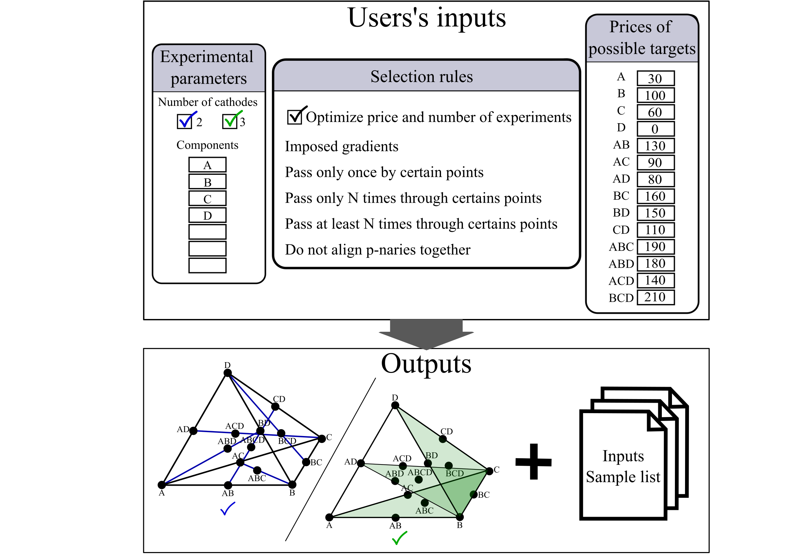

# Experiments Plannification

A Matlab GUI interface was developed in order to automatically generate a set of experiments to screen a N-element composition space using a combinatorial approach and a 2- to 3-cathodes magnetron sputtering. The starting point of this method is based on simplex centroid mixture design, in order to screen the space as uniformly as possible. From the composition points given by the mixture design, all linear/planar gradients passing by 3/7 of them are computed. Then a set of gradients/planes is chosen in order to pass at least once by each point and to respect the user inputs. The choice is done with a random exploration of all possible gradients, that starts all over again if the set does not meet the requirements. 

## Content

* Matlab LiveScript with title and main comment should be executed by the user.
* Documentation of the modules is given in [main documentation](../Documentation/Accelerated Exploration Of Multinary Systems modules.pdf)
* `Examples` folder contains two examples, both with five elements, and 2 or 3 cathodes with imposed selection rules are given. Results on LiveScript are given in html and pdf, while saved documents are in the subfolders. 

## Features :
* Adaptability to the user’s needs
	* The user enters the elements of the composition space they want to explore (from 3 to 7 elements).
	* Chooses if they are using two or three cathodes
	* Indicates if they want to preferentially explore some point of the mixture design.
* Representation of the composition space and of the gradients/planes that are explored. 
* Give the list of targets that allow to perform the experiments

## Possible user inputs:
* The user chooses the number of cathodes they use: 2 cathodes (blue case) for linear gradients or 3 cathodes (green case) for planar gradients
* They input the elements of the investigated system (from 3 to 7 elements).

__From these, the algorithm computes the list of all possible gradients__

### Selection rules
* Choose or not to optimize the number of experiments and/or the price of the experiments. If selected, users must enter the real or relative prices of targets. The algorithm will execute 500 times and keep the set that minimizes the number of samples and/or the price. 

* __Imposed alignments/gradients:__ 

If the centre of a tetrahedron is particularly interesting, the user can choose to screen it finely by passing several times through the quaternary, from all directions (symmetric screening). They will impose the inclusion of the following set: A-ABCD-BCD, B-ABCD-ACD, C-ABCD-ABD, D-ABCD-ABC.

* __No repeat: pass only once through certain points__

In the previous case, the user is probably less interested in the border of the domain. They do not want to explore exhaustively the binaries, thus they can select all the binaries in order to pass only once by each of these points.

__/!\ Depending on the mixture the users will chose, they can be no solution. After 10 attempts, the algorithm stops and displays “No solution found”__

* __Repeat only:__

The user wants to introduce a form of symmetry in the screening: they want to pass an even number of time through each unary/pure element. They impose a maximum number on gradients containing the same pure element. 

 __/!\ There can be no solution found if the user is too restrictive.__

* __Repeat at least:__

The user can screen finely the center of the tetrahedron without imposing a specific gradient selection, but simply by imposing a minimum number of gradients including it. 

* __Do not align mixture of order:__

If the border of the composition is less interesting, the user wants to exclude the edges of the tetrahedron, meaning the gradients of type A-AB-B. They must then tick the box “1” to reject gradients containing 2 pure elements. 

### Optimization of price and number of experiments
User must input the prices of all the possible targets that can be used, either one by one in a GUI, either by loading a csv file that contain the target mixture associated to the price (see `Example` folder). The optimization is made by 500 draws among which are selected the best ones (one that optimize the price and one that optimizethe number of experiments, that can be different from one another)

### Return 

* The algorithm returns a representation of the gradients (linear in blue and planar in green). 

* Finally, the user can input path to save the results. A folder “X_cathodes_A_B_C_D_day_hour” is created, in which we save the matlab figures, the list of targets the user needs, the list of samples, and the try parameters (users’input).
 

